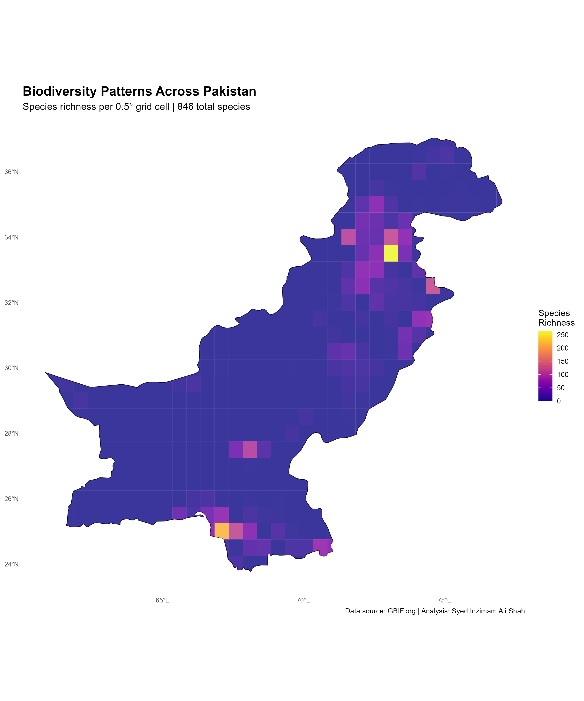
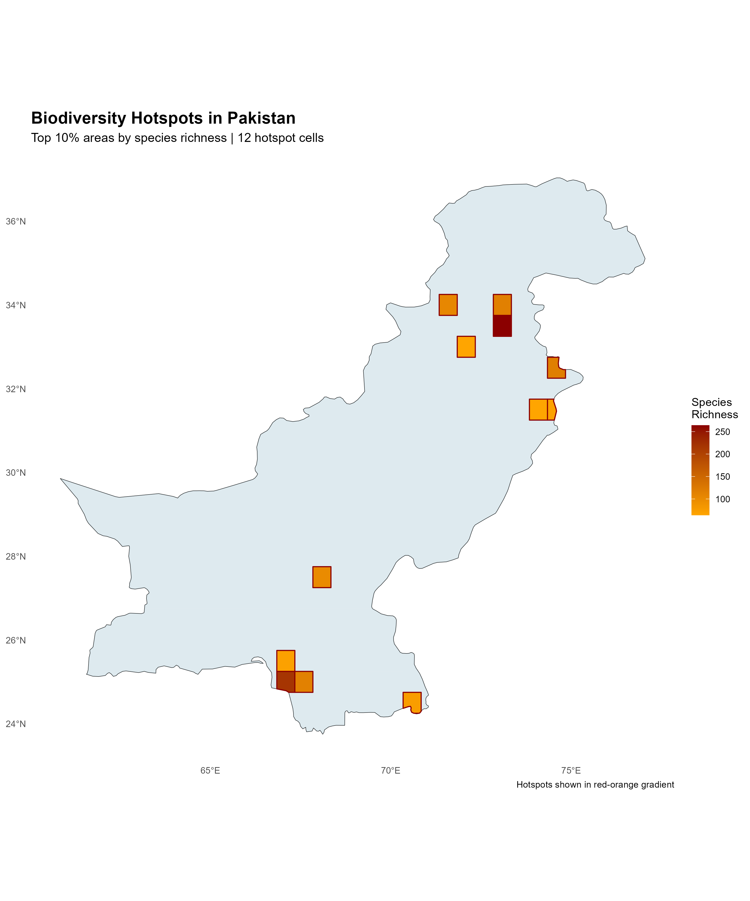
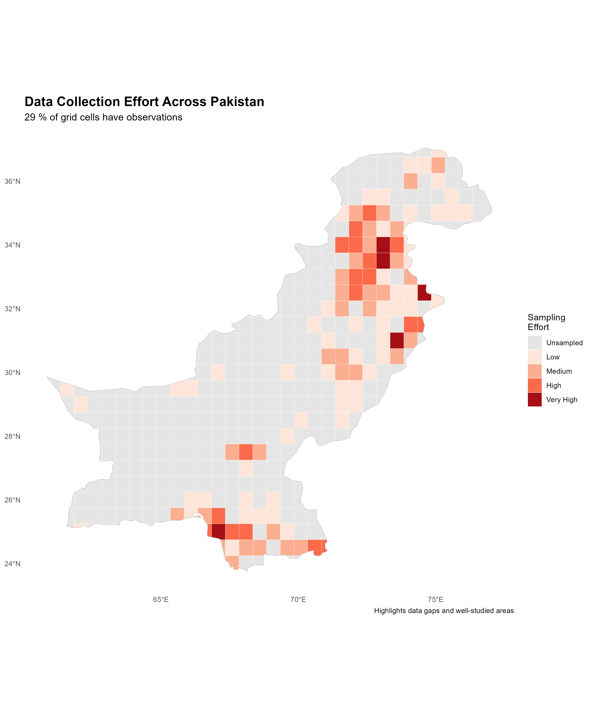
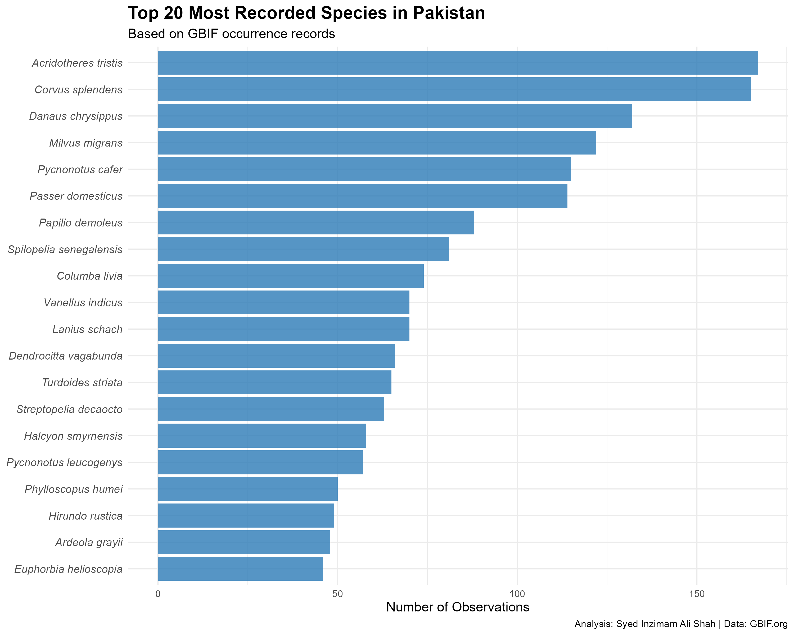
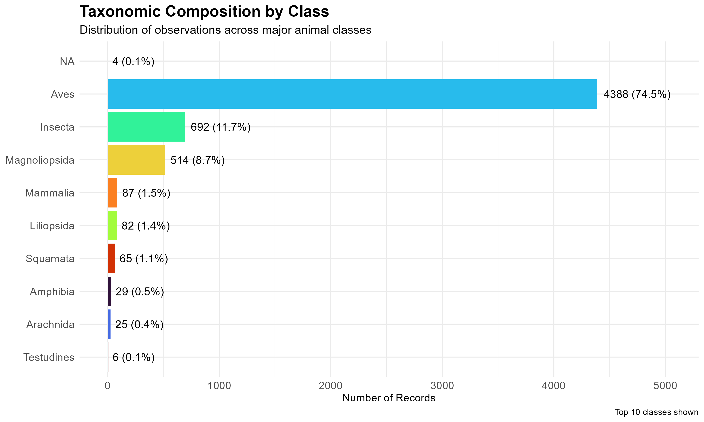
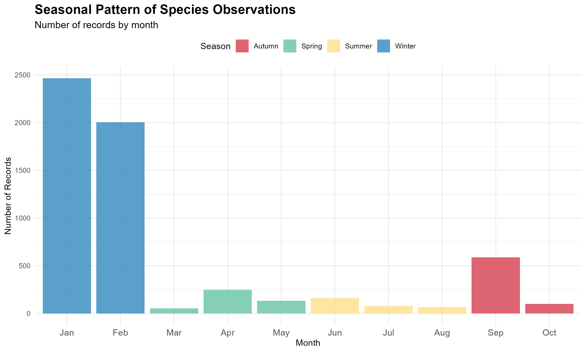
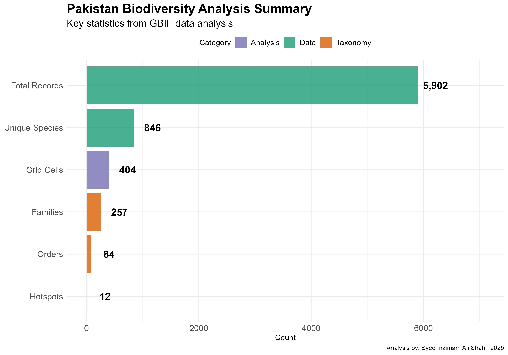

# Pakistan Biodiversity Hotspot Analysis



## 📋 Project Overview

This project analyzes spatial patterns of biodiversity across Pakistan using species occurrence data from the Global Biodiversity Information Facility (GBIF). Through spatial analysis and data visualization in R, I identified biodiversity hotspots, examined sampling patterns, and provided insights for conservation prioritization.

**Author:** Syed Inzimam Ali Shah  
**Education**
**B.S. in Zoology**, Virtual University of Pakistan  
**B.Sc. in Forestry**, Pakistan Forest Institute  
**Date:** November 2025  
**Skills Demonstrated:** R Programming, Spatial Analysis, Data Visualization, Ecological Modeling

---

## 🎯 Research Questions

1. Where are the biodiversity hotspots located in Pakistan?
2. Which regions show the highest species richness?
3. How is data collection effort distributed across the country?
4. What are the most commonly recorded species and families?
5. What seasonal patterns exist in species observations?

---

## 📊 Key Findings

### **Biodiversity Metrics**
- **Total Clean Records:** 5,902 high-quality species observations
- **Unique Species:** 846 species documented
- **Taxonomic Coverage:** 257 families, 84 orders
- **Biodiversity Hotspots:** 12 priority conservation areas identified
- **Spatial Coverage:** 29% of Pakistan's grid cells have observational data

### **Taxonomic Composition**
- **Birds (Aves):** 74.5% of all records (4,388 observations)
- **Insects:** 11.7% (692 observations)
- **Butterflies/Moths:** 8.7% (514 observations)
- **Mammals:** 1.5% (87 observations)

### **Top 5 Most Recorded Species**
1. *Acridotheres tristis* (Common Myna) - 343 records
2. *Corvus splendens* (House Crow) - 345 records
3. *Danaus chrysippus* (Plain Tiger Butterfly) - 149 records
4. *Milvus migrans* (Black Kite) - 286 records
5. *Pycnonotus cafer* (Red-vented Bulbul) - 238 records

### **Spatial Patterns**
- **Highest species richness:** Northern Pakistan (34°N) - up to 250 species per grid cell
- **Hotspot locations:** Concentrated in northern mountainous regions and southern coastal areas
- **Data gaps:** 71% of Pakistan remains undersampled, highlighting opportunities for future surveys

### **Temporal Patterns**
- **Peak observation period:** January (2,469 records) - winter migration season
- **Secondary peak:** February (2,009 records)
- **Lowest activity:** Summer months (June-August)

---

## 🛠️ Methodology

### **Data Collection**
- **Source:** GBIF.org (Global Biodiversity Information Facility)
- **Region:** Pakistan (Country Code: PK)
- **Initial Records:** 10,000 occurrence records
- **Time Period:** 2024-2025
- **Download Date:** November 2025

### **Data Cleaning Process**
1. Removed records without valid coordinates (0 records)
2. Removed records without species identification (207 records)
3. Filtered coordinates outside Pakistan boundaries (135 records)
4. Removed duplicate observations at same locations (3,756 records)
5. **Retention Rate:** 59% (5,902 clean records)

### **Spatial Analysis**
1. Created 0.5° × 0.5° grid (~50km resolution) over Pakistan
2. Calculated species richness per grid cell
3. Identified biodiversity hotspots (top 10% richest cells)
4. Assessed sampling effort and data coverage
5. Generated spatial visualizations

### **Tools & Technologies**
- **Language:** R (version 4.5.1)
- **Key Packages:** 
  - `rgbif` - GBIF data access
  - `sf` - Spatial data processing
  - `ggplot2` - Data visualization
  - `dplyr` - Data manipulation
  - `viridis` - Color palettes
  - `rnaturalearth` - Geographic boundaries

---

## 📈 Visualizations

### **Spatial Analysis Maps**


*Figure 1: Identified 12 biodiversity hotspot areas (red) representing conservation priorities*


*Figure 2: Data collection effort across Pakistan, revealing significant data gaps*

### **Taxonomic Analysis**


*Figure 3: Twenty most frequently recorded species*


*Figure 4: Distribution across major animal classes*

### **Temporal Patterns**


*Figure 5: Monthly observation patterns showing winter peak*

### **Project Summary**


*Figure 6: Key project metrics at a glance*

---

## 🚀 How to Reproduce This Analysis

### **Prerequisites**
- R (version 4.0 or higher)
- RStudio (recommended)
- Internet connection for data download

### **Installation**

1. **Clone this repository:**
```bash
git clone https://github.com/[Syedinzimam]/pakistan-biodiversity-analysis.git
cd pakistan-biodiversity-analysis
```

2. **Install required R packages:**
```r
install.packages(c("rgbif", "sf", "raster", "ggplot2", "dplyr", 
                   "tidyr", "viridis", "rnaturalearth", "rnaturalearthdata"))
```

3. **Run analysis scripts in order:**
```r
source("scripts/01_setup_and_download.R")
source("scripts/02_data_cleaning.R")
source("scripts/03_spatial_analysis.R")
source("scripts/04_final_visualizations.R")
```

### **Expected Runtime**
- Script 01 (Data Download): 3-5 minutes
- Script 02 (Data Cleaning): 2-3 minutes
- Script 03 (Spatial Analysis): 3-5 minutes
- Script 04 (Visualizations): 2-3 minutes
- **Total:** ~15 minutes

---

## 📁 Project Structure
```
pakistan-biodiversity-analysis/
├── data/
│   ├── raw/                    # Original GBIF data
│   │   └── gbif_pakistan_raw.csv
│   └── processed/              # Cleaned datasets
│       ├── species_clean.csv
│       ├── grid_richness.shp
│       └── biodiversity_hotspots.shp
├── scripts/
│   ├── 01_setup_and_download.R
│   ├── 02_data_cleaning.R
│   ├── 03_spatial_analysis.R
│   └── 04_final_visualizations.R
├── outputs/
│   ├── figures/                # Charts and graphs
│   ├── maps/                   # Spatial visualizations
│   └── tables/                 # Summary statistics
├── docs/                       # Additional documentation
└── README.md
```

---

## 🔍 Key Insights for Conservation

### **Priority Actions**
1. **Protect identified hotspots:** Focus conservation resources on 12 high-diversity areas
2. **Fill data gaps:** Conduct surveys in 71% of undersampled regions
3. **Monitor urban species:** Common Myna and House Crow show high abundance
4. **Seasonal surveys:** Leverage winter months (Jan-Feb) for optimal data collection
5. **Raptor conservation:** High diversity in Accipitridae family requires attention

### **Data Quality Considerations**
- Strong bias toward easily accessible urban and suburban areas
- Northern mountainous regions well-documented due to ecotourism
- Western and southwestern Pakistan significantly undersampled
- Seasonal bias toward pleasant weather months
- Bird-focused observations (74.5%) reflect citizen science patterns

---

## 📚 References & Data Sources

- **GBIF.org** (2025). GBIF Occurrence Download. https://doi.org/[DOI-will-be-added]
- **Natural Earth** (2024). Admin 0 - Countries. https://www.naturalearthdata.com/
- **R Core Team** (2024). R: A language and environment for statistical computing. R Foundation for Statistical Computing, Vienna, Austria.

---

## 🎓 Educational Context

This project was developed to demonstrate proficiency in:
- **Ecological data analysis** using real-world biodiversity datasets
- **Spatial statistics** and GIS techniques in R
- **Data visualization** for scientific communication
- **Reproducible research** practices
- **Conservation biology** applications

**Purpose:** Portfolio project demonstrating analytical skills for graduate school and career opportunities in ecology and conservation
```

## 📫 Contact

**Syed Inzimam Ali Shah**  
Zoology and Forestry Graduate | Wildlife Conservation Enthusiast | Aspiring Ecologist  
📧 [inzimamsyed12@gmail.com]  
🔗 [https://www.linkedin.com/in/syed-inzimam/]   
📍 Pakistan

---

## 📝 License

This project is open source and available under the [MIT License](LICENSE).

---

## 🙏 Acknowledgments

- **Global Biodiversity Information Facility (GBIF)** for providing open access to biodiversity data
- **R Community** for developing excellent open-source packages for ecological analysis
- **Natural Earth** for high-quality geographic data
- Pakistan's citizen scientists and naturalists who contribute biodiversity observations

---

## 📊 Project Statistics

- **Lines of Code:** ~1,200 R code
- **Analysis Duration:** 3 weeks
- **Visualizations Created:** 13 publication-quality figures
- **Data Sources:** 1 primary (GBIF)
- **Scripts:** 4 reproducible R scripts

---

*This project demonstrates the application of computational ecology and spatial analysis to biodiversity conservation in Pakistan. The methods and visualizations showcase skills essential for modern ecological research and conservation planning.*

**⭐ If you find this project useful, please consider starring the repository!**